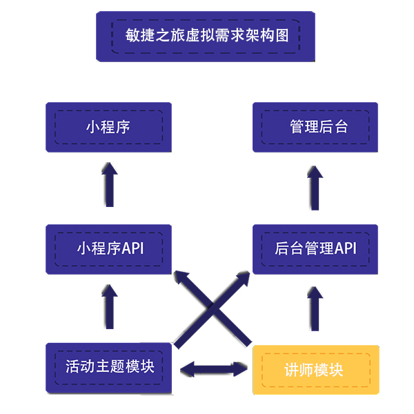

#agile-journey-demo

### DEMO说明
- 此项目是本次敏捷之旅Remote 工作坊的演示demo，主要目的是演示远程协作流程
- 大家可以直接 `git clone https://github.com/linmadan/agile-journey-demo.git` 到本地
- 安装go环境，直接在项目根目录下运行 `go mod tidy` 安装依赖包。如需代理，设置环境变量`GOPROXY=https://goproxy.io`

### 工作坊准备清单
- github账号
- 本地k8s环境，mac与win10（家庭版不能安装）用户可安装docker桌面版，启动k8s选项
- 示例代码使用go编写，请安装go环境，选择一个IDE
- 腾讯云账号，账号最好充点钱，到时需要按量购买服务器实例，搭建云端k8s环境
- 最好能事先在本地k8s环境中安装postgresql数据库与pgadmin4
- 如k8s安装实在有困难也可自己在本地安装postgresql数据库与pgadmin4

### 敏捷之旅虚拟需求
- 这次敏捷之旅需要一个应用系统进行宣传，功能包括两部分：
  - 活动主题与专场
  - 讲师个人与分享的内容
- 需求方需要一个前端小程序来宣传这次活动，还需要一个后台web管理应用来对活动内容及讲师进行添加，编辑等操作
- 业务非常复杂，而且后期需求变动可能很大，还可能会碰到高并发的场景

### 虚拟团队背景
- 开发团队成员分布在全国各地，平时以远程协作方式开发，包括运维与测试工程师
- 团队成员对敏捷开发，devops等非常认同，对自动化测试，ci/cd等研发实践在工作中对个人与团队的作用有深入认识

### 虚拟解决方案
- 由于需求复杂而且多变，单体应用不合适这个项目，因此采用微服务架构
- 技术选型：决定基于k8s来支持可扩展，容错的微服务，实践devops，语言与框架无要求
- 系统简单架构图：

### 虚拟工作分配
- `你`负责`ci/cd管道`的搭建以及独自开发后端`讲师模块`的业务功能
- 此模块功能需要提供接口给`活动模块`，`小程序api`，`管理后台api`调用，还需要调用`活动模块`接口
- 其他团队成员分配了`剩余的模块`

### 虚拟工作计划
- 第一次迭代目标
  - 基于github与腾讯云k8s引擎搭建ci/cd管道，先实现dev环境的ci/cd步骤
  - 基于最简单的用例各模块先打通互调，后续在此基础上迭代完善
  - 讲师模块将在第一次迭代中，完成讲师的CURD接口
- 后续目标
  - ..................................
  
### 工作步骤
- 1.搭建ci/cd管道
- 2.搭建本地开发环境
- 3.创建github仓库
- 4.配置dev环境下的ci/cd步骤
- 5.根据第一次迭代目标的简单用例，编写自动api功能测试用例，完成业务功能，编写api文档
- 6.提交代码到github，自动构建应用并部署到开发环境
- 7.重复`5`,`6`这两个步骤，持续集成，发布到开发环境（每天可进行多次）

### 便捷资源
- postgresql chart地址：`http://47.101.55.93/postgresql-8.0.0.tgz`
- postgresql helm 安装参数：
  - postgresqlUsername ：postgres
  - postgresqlPassword ：123456
  - persistence.enabled ：false
- pgadmin4 chart地址：`http://47.101.55.93/pgadmin-1.0.5.tgz`
- pgadmin4 helm 安装参数：
  - service.type: NodePort
  - env.username : pgadmin4
  - env.password : 123456
  - persistence.enabled : false

### 补充说明
- ci/cd工具的选择，每个环境的ci/cd具体步骤设定，都需要根据实际情况进行权衡，选择最合适团队的方案
- 工具与步骤可能不同，但是流程与理念是一致的